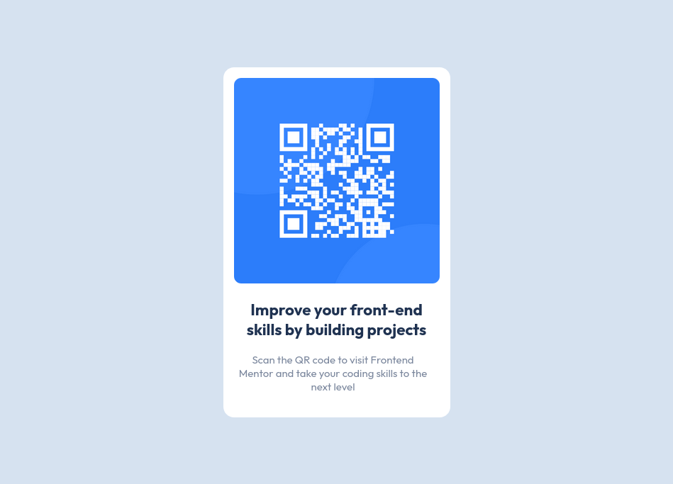

# Frontend Mentor - QR Code Component solution

This is a solution to the [QR code component challenge on Frontend Mentor](https://www.frontendmentor.io/challenges/qr-code-component-iux_sIO_H).

## Table Of Contents

- [Overview](#overview)
  - [Screenshot](#screenshot)
  - [Live Site](#live-site)
- [My Process](#my-process)
  - [Built With](#built-with)
  - [Useful Resources](#useful-resources)
- [Author](#author)

## Overview

### Screenshot

### Live Site

- [Live site](https://your-live-site-url.com)

## My Process

### Built With

- Semantic HTML5 markup
- CSS custom properties
- Flexbox

### Useful Resources

- [Learn about Flexbox](https://developer.mozilla.org/en-US/docs/Learn/CSS/CSS_layout/Flexbox)
- [Learn about max-width](https://developer.mozilla.org/en-US/docs/Web/CSS/max-width)

## Author

- Frontend Mentor - [@hait1mou](https://www.frontendmentor.io/profile/hait1mou)
